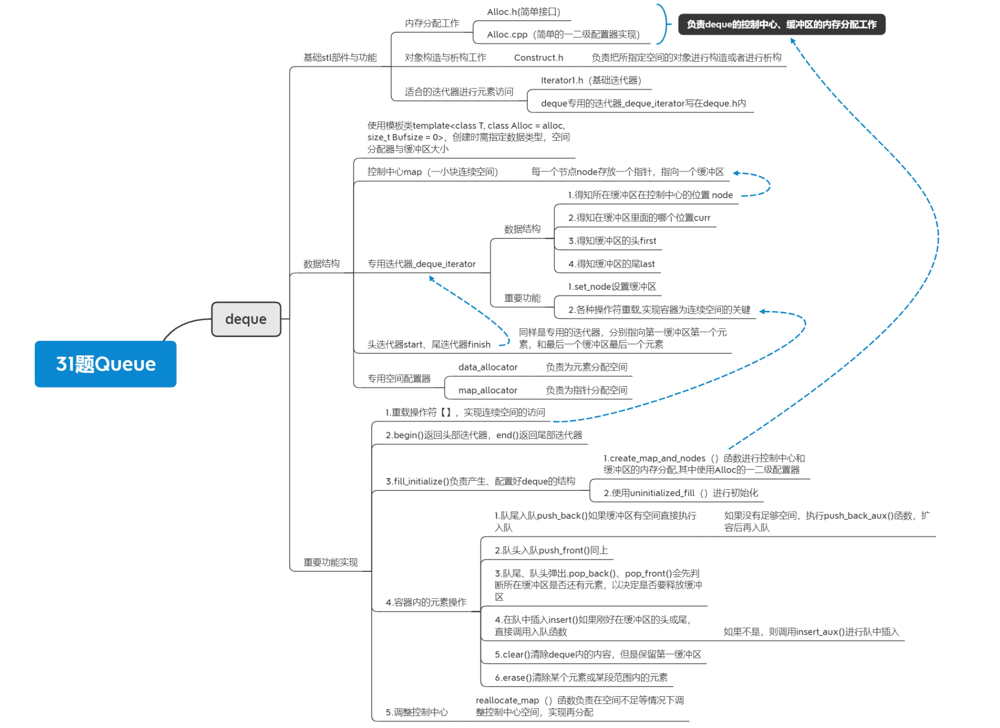

## 项目介绍

大二作业项目存档

学习数据结构时的一个作业项目，根据《STL源码剖析》一书和一些博客的文章进行stl中queue的仿写

A homework project when learning data structures, based on the book *The Annotated STL Sources(using SGI STL)*and some blog articles to imitate the queue

### 运行

> 可运行仿写queue.cpp测试

